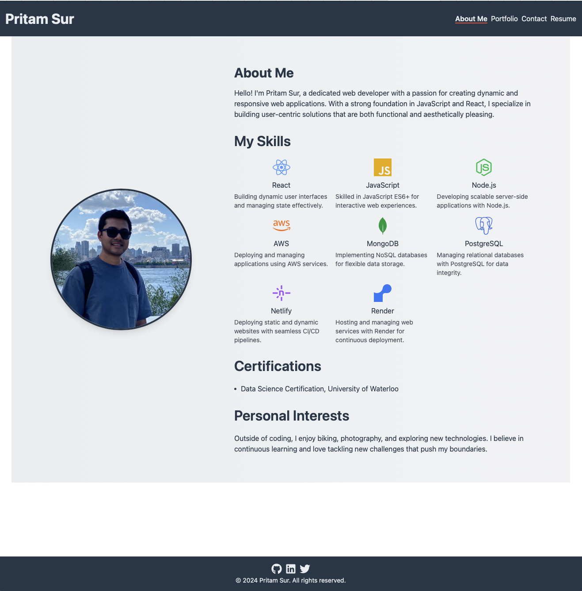

# 📚 Pritam's React Portfolio

 <!-- Replace with your actual screenshot -->

## Table of Contents

1. [Introduction](#introduction)
2. [Features](#features)
3. [Technologies Used](#technologies-used)
4. [Getting Started](#getting-started)
   - [Prerequisites](#prerequisites)
   - [Installation](#installation)
5. [Usage](#usage)
6. [Deployment](#deployment)
7. [License](#license)
8. [Contact](#contact)

---

## Introduction

Welcome to my **React Portfolio**! This project is a personal portfolio website showcasing my skills, projects, certifications, and personal interests. Built with **React**, **Vite**, and **Tailwind CSS**, it offers a modern, responsive, and interactive user experience.

## Features

- **About Me Section:** Introduces who I am, my skills, certifications, and personal interests.
- **Resume Section:** Details my proficiencies in various technologies and provides a downloadable resume.
- **Portfolio Section:** Showcases my projects with descriptions and links.
- **Contact Section:** A functional contact form to send messages directly to my email.
- **Responsive Design:** Ensures the website looks great on all devices, from mobile phones to desktops.
- **Smooth Animations:** Enhances user experience with subtle animations and hover effects.
- **Accessibility:** Designed with accessibility best practices in mind for an inclusive experience.

## Technologies Used

- **[React](https://reactjs.org/):** JavaScript library for building user interfaces.
- **[Vite](https://vitejs.dev/):** Fast and lean development tool for modern web projects.
- **[Tailwind CSS](https://tailwindcss.com/):** Utility-first CSS framework for rapid UI development.
- **[React Icons](https://react-icons.github.io/react-icons/):** Popular icon library for React projects.
- **[Netlify](https://www.netlify.com/):** Platforms for deploying the portfolio website.


## Getting Started

Follow these instructions to set up and run the project locally on your machine.

### Prerequisites

Ensure you have the following installed:

- **[Node.js](https://nodejs.org/):** JavaScript runtime environment.
- **[npm](https://www.npmjs.com/):** Node package manager (comes with Node.js).

### Installation

1. **Clone the Repository**

   ```bash
   git clone https://github.com/surpritam/ps-react-portfolio.git
   cd ps-react-portfolio
   ```
2. Install dependencies
    ```bash
    npm install
    ```
3. Run the development server
    ```bash
    npm run dev
    ```
   Open http://localhost:5173 in your browser to view the portfolio

### Usage

- Navigating the Portfolio:
    - Use the navigation bar to access different sections: About Me, Resume, Portfolio, and Contact.
- Downloading Resume:
    - Click the “Download Resume” button in the Resume section to download a PDF version of my resume.
- Sending a Message:
    - Fill out the contact form and submit to send me a message directly.(EmailJS is yet to be integrated for the messages to be sent). For now reach out to me on LinkedIn or X.

### Deployment

The portfolio is deployed on Netlify: https://main--blissful-dev-portfolio.netlify.app

### License

This project is licensed under the MIT License. 

### Contact

- [Email](sur.pritam9878@gmail.com)
- [linkedin.com/in/pritam-sur](https://linkedin.com/in/pritam-sur) 
- [GitHub](https://github.com/surpritam)

Feel free to reach out for any inquiries or collaborations!
